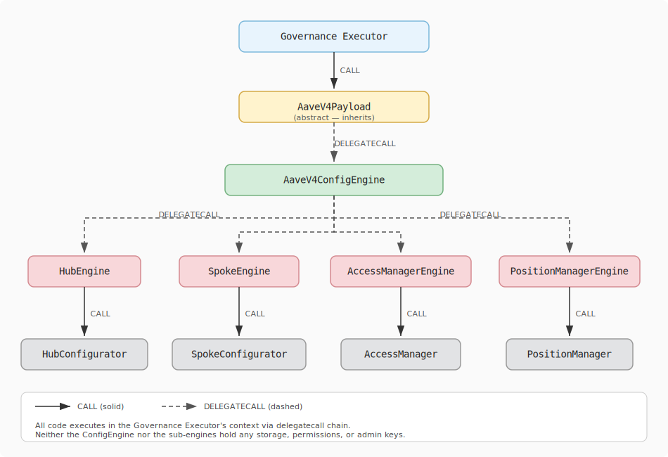

# Aave V4 config engine

## What is the AaveV4ConfigEngine?

The `AaveV4ConfigEngine` is a helper smart contract to abstract best practices when interacting with the Aave V4 protocol via governance payloads, without modifying core contracts.

Based on experience reviewing governance payloads for Aave V3, the config engine provides a type-safe, composable interface that covers the most common administrative operations: Hub configuration, Spoke configuration, AccessManager role management, and PositionManager administration.

The engine itself is **stateless** — it never stores data of its own. Payloads invoke it via `delegatecall`, so every external call the engine makes executes in the payload's (governance executor's) context and with the executor's permissions.

## How to use the engine?

Instead of calling `AaveV4ConfigEngine` directly, payload authors inherit from the **`AaveV4Payload`** abstract base contract. `AaveV4Payload` receives the engine address in its constructor and exposes virtual functions — one per action type — that return empty arrays by default. The payload simply overrides the functions relevant to the proposal, returning the desired configuration structs.

When governance calls `execute()`, the base contract loops through each action category and delegate-calls the engine for every non-empty array.

### Action categories

The four groups, and the virtual functions in each, are listed below.

#### Hub actions (`_executeHubActions`)

| Function                      | Struct                  | Purpose                                                                                               |
| ----------------------------- | ----------------------- | ----------------------------------------------------------------------------------------------------- |
| `hubAssetListings()`          | `AssetListing`          | List a new asset on a Hub. Optionally deploys a TokenizationSpoke if `symbol` `and name` are defined. |
| `hubAssetConfigUpdates()`     | `AssetConfigUpdate`     | Update fee config, IR strategy/data, reinvestment controller                                          |
| `hubSpokeToAssetsAdditions()` | `SpokeToAssetsAddition` | Register a Spoke for multiple assets                                                                  |
| `hubSpokeConfigUpdates()`     | `SpokeConfigUpdate`     | Update Spoke caps, risk premium threshold, active/halted                                              |
| `hubAssetHalts()`             | `AssetHalt`             | Halt an asset                                                                                         |
| `hubAssetDeactivations()`     | `AssetDeactivation`     | Deactivate an asset                                                                                   |
| `hubAssetCapsResets()`        | `AssetCapsReset`        | Reset asset caps                                                                                      |
| `hubSpokeDeactivations()`     | `SpokeDeactivation`     | Deactivate a Spoke                                                                                    |
| `hubSpokeCapsResets()`        | `SpokeCapsReset`        | Reset Spoke caps                                                                                      |

#### Spoke actions (`_executeSpokeActions`)

| Function                               | Struct                         | Purpose                                                                                |
| -------------------------------------- | ------------------------------ | -------------------------------------------------------------------------------------- |
| `spokeReserveListings()`               | `ReserveListing`               | List a new reserve on a Spoke                                                          |
| `spokeReserveConfigUpdates()`          | `ReserveConfigUpdate`          | Update price source, collateral risk, paused, frozen, borrowable, receiveSharesEnabled |
| `spokeLiquidationConfigUpdates()`      | `LiquidationConfigUpdate`      | Update liquidation config                                                              |
| `spokeDynamicReserveConfigAdditions()` | `DynamicReserveConfigAddition` | Add a dynamic reserve config                                                           |
| `spokeDynamicReserveConfigUpdates()`   | `DynamicReserveConfigUpdate`   | Update a dynamic reserve config                                                        |
| `spokePositionManagerUpdates()`        | `PositionManagerUpdate`        | Activate/deactivate a PositionManager on a Spoke                                       |

#### AccessManager actions (`_executeAccessManagerActions`)

| Function                                   | Struct                     | Purpose                                               |
| ------------------------------------------ | -------------------------- | ----------------------------------------------------- |
| `accessManagerRoleMemberships()`           | `RoleMembership`           | Grant or revoke a role (dispatched by `granted` bool) |
| `accessManagerRoleUpdates()`               | `RoleUpdate`               | Set role admin, guardian, grant delay, and/or label   |
| `accessManagerTargetFunctionRoleUpdates()` | `TargetFunctionRoleUpdate` | Map selectors to a role                               |
| `accessManagerTargetAdminDelayUpdates()`   | `TargetAdminDelayUpdate`   | Set target admin delay                                |

#### PositionManager actions (`_executePositionManagerActions`)

| Function                              | Struct                            | Purpose                         |
| ------------------------------------- | --------------------------------- | ------------------------------- |
| `positionManagerSpokeRegistrations()` | `SpokeRegistration`               | Register/deregister a Spoke     |
| `positionManagerRoleRenouncements()`  | `PositionManagerRoleRenouncement` | Renounce a PositionManager role |

## Internal aspects to consider

### Execution hooks

`AaveV4Payload` exposes two virtual hooks:

- **`_preExecute()`** — called before any engine action.
- **`_postExecute()`** — called after all engine actions complete.

Override these to add custom logic (e.g. granting temporary permissions before the batch and revoking them afterwards).

### Execution ordering

When `execute()` is called, actions run in the following fixed order:

1. `_preExecute()`
2. **AccessManager actions** (in order):
   1. Role memberships (grants / revocations)
   2. Role updates (admin, guardian, grant delay, label)
   3. Target function role updates
   4. Target admin delay updates
3. **Hub actions** (in order):
   1. Asset listings
   2. Asset config updates
   3. Spoke-to-assets additions
   4. Spoke config updates
   5. Asset halts
   6. Asset deactivations
   7. Asset caps resets
   8. Spoke deactivations
   9. Spoke caps resets
4. **Spoke actions** (in order):
   1. Reserve listings
   2. Reserve config updates
   3. Liquidation config updates
   4. Dynamic reserve config additions
   5. Dynamic reserve config updates
   6. Position manager updates
5. **PositionManager actions** (in order):
   1. Spoke registrations
   2. Role renouncements
6. `_postExecute()`

### The `KEEP_CURRENT` sentinel pattern

The `EngineFlags` library defines sentinel values for each width that needs a "skip" marker:

| Constant               | Type      | Value                        |
| ---------------------- | --------- | ---------------------------- |
| `KEEP_CURRENT`         | `uint256` | `type(uint256).max - 652`    |
| `KEEP_CURRENT_ADDRESS` | `address` | `address(type(uint160).max)` |
| `KEEP_CURRENT_UINT64`  | `uint64`  | `type(uint64).max - 46`      |
| `KEEP_CURRENT_UINT32`  | `uint32`  | `type(uint32).max - 23`      |
| `KEEP_CURRENT_UINT16`  | `uint16`  | `type(uint16).max - 61`      |

When a struct field is set to its corresponding sentinel, the engine **skips** updating that field and leaves the on-chain value unchanged. This lets a single struct express partial updates — for example, changing the liquidity fee without touching the fee receiver or IR strategy.

`EngineFlags` also provides boolean convenience constants (`ENABLED = 1`, `DISABLED = 0`) and conversion helpers `toBool(uint256)` / `fromBool(bool)`.

### Smart partial updates

Several engine functions inspect which fields differ from `KEEP_CURRENT` and choose the most efficient on-chain call:

- **Asset config** (`HubEngine.executeHubAssetConfigUpdates`) — dispatches fee, IR, and reinvestment controller updates from a single `AssetConfigUpdate` struct. Calls `updateFeeConfig` when both fee and receiver change, `updateLiquidityFee` or `updateFeeReceiver` when only one changes. Calls `updateInterestRateStrategy` when the strategy address changes, or `updateInterestRateData` when only the data changes. Calls `updateReinvestmentController` when the controller address changes.
- **Spoke config** (`HubEngine.executeHubSpokeConfigUpdates`) — dispatches caps, risk premium threshold, and status updates from a single `SpokeConfigUpdate` struct. Calls `updateSpokeCaps`, `updateSpokeAddCap`, or `updateSpokeDrawCap` depending on which caps are modified. Updates active/halted flags independently.
- **Reserve config** (`SpokeEngine.executeSpokeReserveConfigUpdates`) — each flag (priceSource, collateralRisk, paused, frozen, borrowable, receiveSharesEnabled) is updated individually only when it differs from `KEEP_CURRENT` / `KEEP_CURRENT_ADDRESS`.
- **Liquidation config** (`SpokeEngine.executeSpokeLiquidationConfigUpdates`) — calls `updateLiquidationConfig` when all three fields change, otherwise updates each field individually.
- **Dynamic reserve config** (`SpokeEngine.executeSpokeDynamicReserveConfigUpdates`) — reads the current on-chain config, patches only the non-sentinel fields, and writes back the merged result. If nothing changed, the external call is skipped entirely.
- **Role update** (`AccessManagerEngine.executeRoleUpdates`) — a single `RoleUpdate` struct can update any combination of admin (`uint64`), guardian (`uint64`), grant delay (`uint32`), and label (`string`). Fields set to their type-max sentinel (`KEEP_CURRENT_UINT64` / `KEEP_CURRENT_UINT32`) or empty string are skipped.

### Delegatecall architecture

`AaveV4ConfigEngine` stores four deployed sub-engine contract addresses as immutables:

- `HUB_ENGINE` — handles all Hub configurator operations
- `SPOKE_ENGINE` — handles all Spoke configurator operations
- `ACCESS_MANAGER_ENGINE` — handles all AccessManager operations
- `POSITION_MANAGER_ENGINE` — handles all PositionManager operations

When a payload calls `execute()`, `AaveV4Payload` delegate-calls into `AaveV4ConfigEngine`, which in turn delegate-calls into the appropriate sub-engine. This two-level delegatecall chain means:

- All sub-engine code runs in the **payload's storage and `msg.sender` context** (i.e. the governance executor).
- Neither the config engine nor the sub-engines hold any storage, permissions, or admin keys.
- All HubConfigurator, SpokeConfigurator, AccessManager, and PositionManager calls originate from the governance executor's address.
